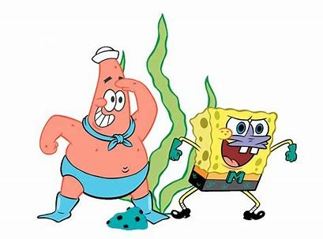

<!DOCTYPE html>
<html lang="pt-br">
<head>
    <meta charset="UTF-8">
    <meta http-equiv="X-UA-Compatible" content="IE=edge">
    <meta name="viewport" content="width=device-width, initial-scale=1.0">
    <title>Siri Cascudo</title>
    <link rel="stylesheet" href="css/style.css">
</head>
<body>
    <header>
        <nav>
            
            <ul>
                <li> <a href="cardapio.html">Cardapío</a></li>
                <li> <a href="#">Lançamento</a></li>
                <li> <a href="#">Quem Somos</a></li>
                <li> <a href="#">Família</a></li>
                <li> <a href="#">Promoções</a></li>
            </ul>   
        </nav>
    </header>
    <main>
        

            
        

        

            <ul class="containerCard">
                <li class="card">
                    
                    
O melhor Hambúrguer de Siri

                </li>
                <li class="card">
                    
                    
Agora com sorvete do amendobobo

                </li>
                <li class="card">
                    
                    
Temos o melhor cozinheiro da fenda do biquini

                </li>
            </ul>
        

    </main>
    <footer>
        

            <h3>Visite a fenda do biquini</h3>
            
<a href="">Conheça o Balde de Lixo</a>

        

    </footer>

    
</body>
</html>
